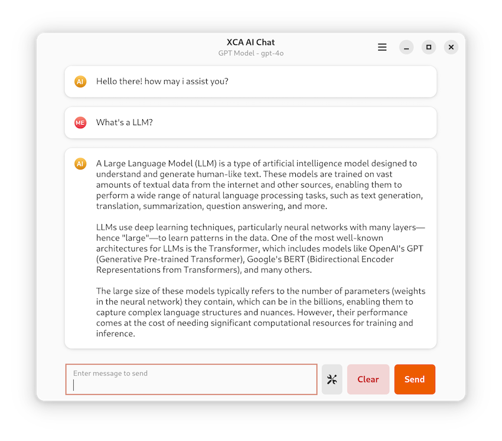
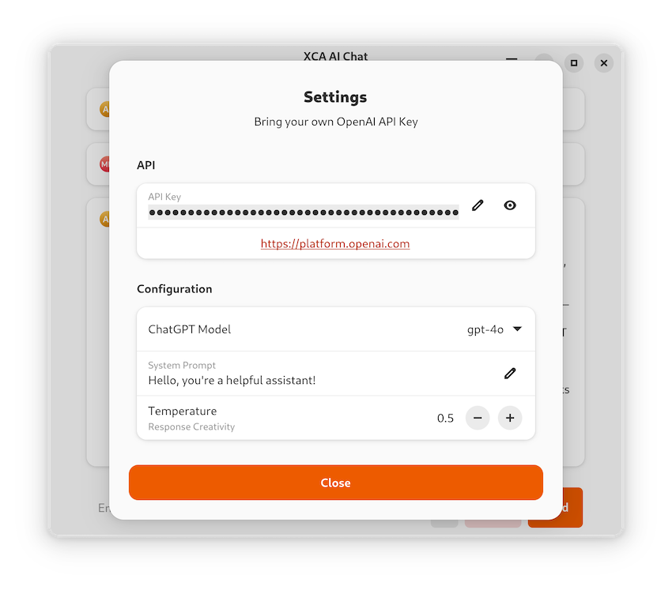

  
  <h1 align="center">XCA AI Chat</h1>

XCA AI Chat is a native GNOME Swift application that lets you interact with OpenAI's ChatGPT API. Simply bring your own OpenAI API key to start a conversation. Your API key is stored locally on your machine for security.

Key features include:
- Support for multiple OpenAI models, including GPT-4 (e.g., gpt-4o, gpt-4o-mini, o1) and GPT-3.5 (e.g., gpt-3.5-turbo)
- Ability to set the system prompt for tailoring conversations
- Adjustable response creativity through temperature settings
- Clean, intuitive user interface optimized for GNOME

## Table of Contents

- [Installation](#Installation)
- [Usage](#Usage)
- [Thanks](#Thanks)

## Installation

The preferred way to install the XCA AI Chat app is via Flathub.

### Build Flatpak Locally

You can also build the app yourself, e.g. to modify the source code.

1. Download this repository's source code and open the folder using [GNOME Builder](https://apps.gnome.org/Builder/).
2. Build and run the project using the run button.
3. Next to the hammer icon, in the dropdown menu, select `Export` and wait for the file browser to appear.
4. Open the `.flatpak` file with [GNOME Software](https://apps.gnome.org/Software/) and install the app.

## Usage

- For first launch, you need to provide the OpenAI API key by clicking on the `preferences` button to open the dialog and fill the API Key field.
- You can select models such as gpt-4o, gpt-3.5-turbo, o1, etc
- Select temperature to determine the randomness of the response (0 will be the most deterministic, 1 will be more creative)
- Provide your own system prompt if any

## Thanks

### Dependencies
- [Adwaita](https://github.com/AparokshaUI/Adwaita) licensed under the [MIT License](https://github.com/AparokshaUI/Adwaita/blob/main/LICENSE.md)
- [Localized](https://github.com/AparokshaUI/Localized) licensed under the [MIT License](https://github.com/AparokshaUI/Localized/blob/master/LICENSE.md)

### Other Thanks
- [Libadwaita](https://gnome.pages.gitlab.gnome.org/libadwaita/doc/1.4/) and [GTK](https://docs.gtk.org/gtk4/) for the UI widgets
- [GNOME Builder](https://apps.gnome.org/Builder/) and many other apps